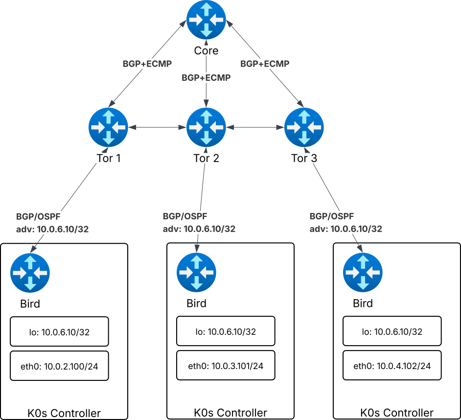

# [POC] Control plane load balancing (Anycast)

Control plane load balancing (Anycast) is a feature that allows you to use Anycast IP addresses to access the control plane. Load balancing is achieved by using ECMP (Equal Cost MultiPath) for the BGP sessions to the core router.

## Configuration
Lab has been deployed using 7 Virtual machines (see diagram below):
1. 1 Core router which may be used as an entry point for the cluster (frr is deployed on it)
1. 3 "TOR" routers which will be used to connect the control plane nodes and establish BGP sessions (frr is deployed on them)
1. 3 Control plane nodes which will be used to deploy the k0s control plane (k0s is deployed on them)



### Core router configuration
```
frr version 8.4.4
frr defaults traditional
hostname dukov-ext-router
log syslog informational
no ipv6 forwarding
service integrated-vtysh-config
!
router bgp 65001
 bgp router-id 10.0.1.199
 neighbor PG-TORS peer-group
 neighbor PG-TORS remote-as 65001
 neighbor 10.0.1.11 peer-group PG-TORS
 neighbor 10.0.1.12 peer-group PG-TORS
 neighbor 10.0.1.13 peer-group PG-TORS
 !
 address-family ipv4 unicast
  neighbor PG-TORS activate
  maximum-paths ibgp 3
 exit-address-family
exit
!
```

### TOR routers configuration
#### TOR router 1 configuration
```
frr version 8.4.4
frr defaults traditional
hostname dukov-tor1
log syslog informational
no ipv6 forwarding
service integrated-vtysh-config
!
interface lo
 ip address 10.0.1.11/32
exit
!
router bgp 65001
 bgp router-id 10.0.1.11
 neighbor 10.0.1.199 remote-as 65001
 neighbor 10.0.1.199 update-source 10.0.1.11
 neighbor 10.0.1.12 remote-as 65001
 neighbor 10.0.1.12 update-source 10.0.1.11
 neighbor 10.0.1.13 remote-as 65001
 neighbor 10.0.1.13 update-source 10.0.1.11
 neighbor 10.0.2.32 remote-as 65001
 neighbor 10.0.2.32 update-source 10.0.1.11
 !
 address-family ipv4 unicast
  redistribute connected
  # iBGP requires full mesh sessions between all routers in the cluster
  # so we need to use route-reflector-client to reflect the iBGP routes
  # to the core router
  neighbor 10.0.2.32 route-reflector-client
  neighbor 10.0.1.199 addpath-tx-all-paths <- this enables ECMP for the BGP session to the core router
 exit-address-family
exit
!
```

#### TOR router 2 configuration
```
frr version 8.4.4
frr defaults traditional
hostname dukov-tor2
log syslog informational
no ipv6 forwarding
service integrated-vtysh-config
!
interface lo
 ip address 10.0.1.12/32
exit
!
router bgp 65001
 bgp router-id 10.0.1.12
 neighbor 10.0.1.11 remote-as 65001
 neighbor 10.0.1.11 update-source 10.0.1.12
 neighbor 10.0.1.13 remote-as 65001
 neighbor 10.0.1.13 update-source 10.0.1.12
 neighbor 10.0.1.199 remote-as 65001
 neighbor 10.0.1.199 update-source 10.0.1.12
 neighbor 10.0.3.7 remote-as 65001
 neighbor 10.0.3.7 update-source 10.0.1.12
 !
 address-family ipv4 unicast
  redistribute connected
  # iBGP requires full mesh sessions between all routers in the cluster
  # so we need to use route-reflector-client to reflect the iBGP routes
  # to the core router
  neighbor 10.0.3.7 route-reflector-client 
  neighbor 10.0.1.199 addpath-tx-all-paths # this enables ECMP for the BGP session to the core router
 exit-address-family
exit
!
```

#### TOR router 3 configuration
```
frr version 8.4.4
frr defaults traditional
hostname dukov-tor3
log syslog informational
no ipv6 forwarding
service integrated-vtysh-config
!
interface lo
 ip address 10.0.1.13/32
exit
!
router bgp 65001
 bgp router-id 10.0.1.13
 neighbor 10.0.1.11 remote-as 65001
 neighbor 10.0.1.11 update-source 10.0.1.13
 neighbor 10.0.1.12 remote-as 65001
 neighbor 10.0.1.12 update-source 10.0.1.13
 neighbor 10.0.1.199 remote-as 65001
 neighbor 10.0.1.199 update-source 10.0.1.13
 neighbor 10.0.4.201 remote-as 65001
 neighbor 10.0.4.201 update-source 10.0.1.13
 !
 address-family ipv4 unicast
  redistribute connected
  # iBGP requires full mesh sessions between all routers in the cluster
  # so we need to use route-reflector-client to reflect the iBGP routes
  # to the core router
  neighbor 10.0.4.201 route-reflector-client
  neighbor 10.0.1.199 addpath-tx-all-paths # this enables ECMP for the BGP session to the core router
 exit-address-family
exit
!
```

### Control plane nodes configuration
We need to explicitly set k8s api via `spec.api.address` in the k0s.yaml file to avoid setting this values to the Anycast IP address whic is assigned to `lo` interface.
#### Control plane node 1 configuration
```
apiVersion: k0s.k0sproject.io/v1beta1
kind: ClusterConfig
metadata:
  name: k0s-k0sctl
spec:
  api:
    address: 10.0.2.32
    sans:
    - 10.0.2.32
    - 10.0.6.10
    - 172.19.123.15
    - 10.0.5.206
    - 172.19.119.214
    - 10.0.5.212
    - 172.19.119.215
    - 10.0.5.232
  network:
    calico:
      mode: vxlan
    nodeLocalLoadBalancing:
      enabled: true
      type: EnvoyProxy
    controlPlaneLoadBalancing:
      enabled: true
      type: Anycast
      anycast:
        routerID: 10.0.2.32
        anycatIP: 10.0.6.10
        bgp:
          - name: BGP1
            asNumber: 65001
            neighbors:
              - 10.0.1.11
    provider: calico
  storage:
    etcd:
      peerAddress: 10.0.5.206
    type: etcd
```
#### Control plane node 2 configuration
```
Metadata:
  name: k0s-k0sctl
apiVersion: k0s.k0sproject.io/v1beta1
kind: ClusterConfig
spec:
  api:
    address: 10.0.3.7
  network:
    calico:
      mode: vxlan
    nodeLocalLoadBalancing:
      enabled: true
      type: EnvoyProxy
    controlPlaneLoadBalancing:
      enabled: true
      type: Anycast
      anycast:
        routerID: 10.0.3.7
        anycatIP: 10.0.6.10
        bgp:
          - name: BGP1
            asNumber: 65001
            neighbors:
              - 10.0.1.12
    provider: calico
  storage:
    etcd:
      peerAddress: 10.0.5.212
    type: etcd
```

#### Control plane node 3 configuration
```
Metadata:
  name: k0s-k0sctl
apiVersion: k0s.k0sproject.io/v1beta1
kind: ClusterConfig
spec:
  api:
    address: 10.0.4.201
  network:
    calico:
      mode: vxlan
    nodeLocalLoadBalancing:
      enabled: true
      type: EnvoyProxy
    controlPlaneLoadBalancing:
      enabled: true
      type: Anycast
      anycast:
        routerID: 10.0.4.201
        anycatIP: 10.0.6.10
        bgp:
          - name: BGP1
            asNumber: 65001
            neighbors:
              - 10.0.1.13
    provider: calico
  storage:
    etcd:
      peerAddress: 10.0.5.232
    type: etcd
```
## Results
After the configuration is applied, we can see the following:
1. All control plane nodes are able to access the k8s api via the Anycast IP address
1. The traffic is load balanced between the control plane nodes
1. The traffic is load balanced between the BGP sessions to the core router

```
core-router# sh ip ro
...
B>  10.0.6.10/32 [200/0] via 10.0.2.32 (recursive), weight 1, 00:00:09
  *                        via 10.0.1.11, ens4, weight 1, 00:00:09
                         via 10.0.3.7 (recursive), weight 1, 00:00:09
  *                        via 10.0.1.12, ens4, weight 1, 00:00:09
                         via 10.0.4.201 (recursive), weight 1, 00:00:09
  *                        via 10.0.1.13, ens4, weight 1, 00:00:09
```